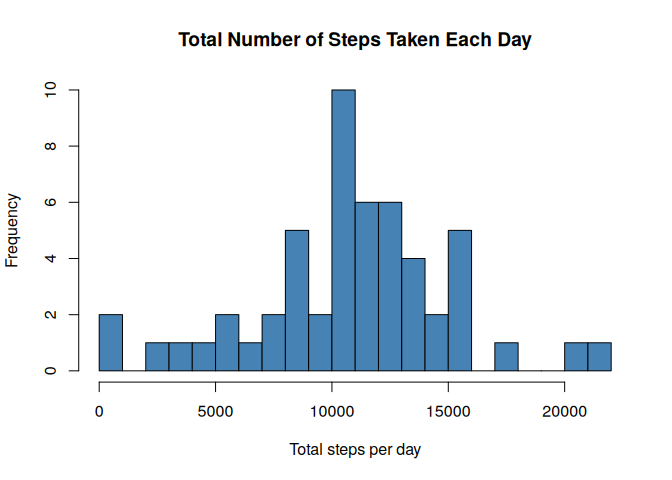
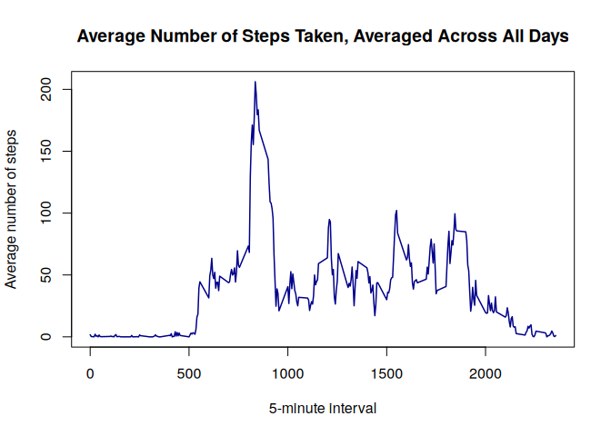
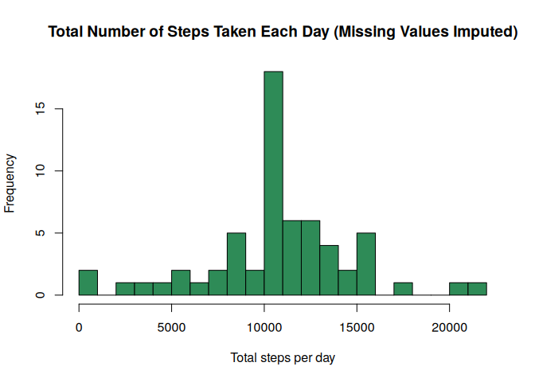
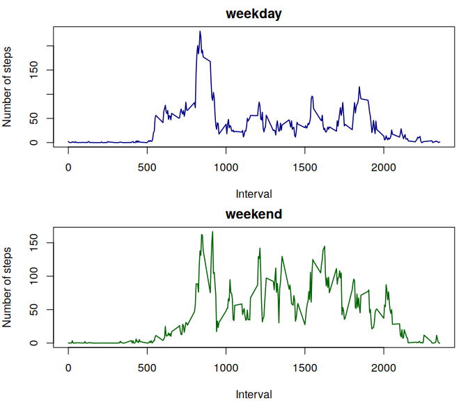

```r
knitr::opts_chunk$set(fig.path = "figure/")
```

## Loading and preprocessing the data

The dataset is read directly from the `activity.csv` file included in the
forked repository. The `date` column is converted from a character string
into an R `Date` object so it can be used for grouping and later for
determining the day of the week.


```r
activity <- read.csv("activity.csv", stringsAsFactors = FALSE)
activity$date <- as.Date(activity$date, format = "%Y-%m-%d")
str(activity)
```

```
## 'data.frame':	17568 obs. of  3 variables:
##  $ steps   : int  NA NA NA NA NA NA NA NA NA NA ...
##  $ date    : Date, format: "2012-10-01" "2012-10-01" ...
##  $ interval: int  0 5 10 15 20 25 30 35 40 45 ...
```

## What is mean total number of steps taken per day?

For this part of the assignment, the missing values (`NA`) in the dataset
are ignored, per the assignment instructions.

### Total number of steps taken per day


```r
steps_per_day <- aggregate(steps ~ date, data = activity, FUN = sum, na.rm = TRUE)
head(steps_per_day)
```

```
##         date steps
## 1 2012-10-02   126
## 2 2012-10-03 11352
## 3 2012-10-04 12116
## 4 2012-10-05 13294
## 5 2012-10-06 15420
## 6 2012-10-07 11015
```

### Histogram of total number of steps taken each day


```r
hist(steps_per_day$steps,
     main = "Total Number of Steps Taken Each Day",
     xlab = "Total steps per day",
     col = "steelblue",
     breaks = 20)
```

<!-- -->

### Mean and median of total number of steps taken per day


```r
mean_steps <- mean(steps_per_day$steps)
median_steps <- median(steps_per_day$steps)
mean_steps
```

```
## [1] 10766.19
```

```r
median_steps
```

```
## [1] 10765
```

The mean total number of steps taken per day is **10,766.19**
and the median is **10,765**.

## What is the average daily activity pattern?

### Time series plot of the average number of steps per interval


```r
interval_avg <- aggregate(steps ~ interval, data = activity, FUN = mean, na.rm = TRUE)

plot(interval_avg$interval, interval_avg$steps, type = "l",
     main = "Average Number of Steps Taken, Averaged Across All Days",
     xlab = "5-minute interval",
     ylab = "Average number of steps",
     col = "darkblue", lwd = 1.5)
```

<!-- -->

### Interval with the maximum average number of steps


```r
max_interval <- interval_avg[which.max(interval_avg$steps), ]
max_interval
```

```
##     interval    steps
## 104      835 206.1698
```

The 5-minute interval **835** contains, on average
across all days in the dataset, the maximum number of steps
(206.17 steps).

## Imputing missing values

### Total number of missing values


```r
total_na <- sum(is.na(activity$steps))
total_na
```

```
## [1] 2304
```

There are **2304** rows with missing `steps` values in the dataset.

### Strategy for filling in missing values

The chosen strategy is to replace each missing value with the **mean number
of steps for that same 5-minute interval**, computed across all days (the
`interval_avg` object calculated above).

### Create a new dataset with the missing data filled in


```r
activity_filled <- activity
na_idx <- is.na(activity_filled$steps)
activity_filled$steps[na_idx] <- interval_avg$steps[match(activity_filled$interval[na_idx],
                                                            interval_avg$interval)]

# Confirm no missing values remain
sum(is.na(activity_filled$steps))
```

```
## [1] 0
```

```r
head(activity_filled)
```

```
##       steps       date interval
## 1 1.7169811 2012-10-01        0
## 2 0.3396226 2012-10-01        5
## 3 0.1320755 2012-10-01       10
## 4 0.1509434 2012-10-01       15
## 5 0.0754717 2012-10-01       20
## 6 2.0943396 2012-10-01       25
```

### Histogram of total steps per day (imputed data)


```r
steps_per_day_filled <- aggregate(steps ~ date, data = activity_filled, FUN = sum)

hist(steps_per_day_filled$steps,
     main = "Total Number of Steps Taken Each Day (Missing Values Imputed)",
     xlab = "Total steps per day",
     col = "seagreen",
     breaks = 20)
```

<!-- -->


```r
mean_steps_filled <- mean(steps_per_day_filled$steps)
median_steps_filled <- median(steps_per_day_filled$steps)
mean_steps_filled
```

```
## [1] 10766.19
```

```r
median_steps_filled
```

```
## [1] 10766.19
```

**Do these values differ from the estimates from the first part of the
assignment?**

| Statistic | Original (NAs ignored) | Imputed |
|---|---|---|
| Mean   | 10,766.19   | 10,766.19 |
| Median | 10,765 | 10,766.19 |

The mean is unchanged, because entire missing days were replaced with a
day built from the average interval profile, whose daily total equals the
mean of the non-missing daily totals. The median shifts slightly and now
coincides with the mean, because several previously-missing days are now
represented by the same "average day" total, adding a cluster of values at
the mean.

**What is the impact of imputing missing data on the estimates of the total
daily number of steps?** Imputation increases the total step count summed
across the whole dataset (since missing days, which contributed 0 to sums
when using `na.rm = TRUE` implicitly via exclusion, are no longer excluded)
and it increases the height of the central bar of the histogram, since the
imputation strategy adds several days whose total is exactly the overall
mean.

## Are there differences in activity patterns between weekdays and weekends?

This part uses `activity_filled`, the dataset with missing values imputed.

### Create the weekday/weekend factor variable


```r
activity_filled$day_type <- factor(
  ifelse(weekdays(activity_filled$date) %in% c("Saturday", "Sunday"),
         "weekend", "weekday")
)

table(activity_filled$day_type)
```

```
## 
## weekday weekend 
##   12960    4608
```

### Panel plot: average steps per interval, weekday vs. weekend


```r
interval_daytype_avg <- aggregate(steps ~ interval + day_type,
                                   data = activity_filled, FUN = mean)

par(mfrow = c(2, 1), mar = c(4, 4, 2, 1))

with(subset(interval_daytype_avg, day_type == "weekday"),
     plot(interval, steps, type = "l", col = "darkblue", lwd = 1.5,
          main = "weekday", xlab = "Interval", ylab = "Number of steps"))

with(subset(interval_daytype_avg, day_type == "weekend"),
     plot(interval, steps, type = "l", col = "darkgreen", lwd = 1.5,
          main = "weekend", xlab = "Interval", ylab = "Number of steps"))
```

<!-- -->

Activity on weekday mornings shows a sharp peak (commuting/exercise around
the 8:00-9:00 interval) followed by comparatively lower activity for the
rest of the day. Weekend activity is more evenly distributed across the
day, with a later start and sustained activity into the afternoon and
evening, consistent with a less rigid daily schedule.
